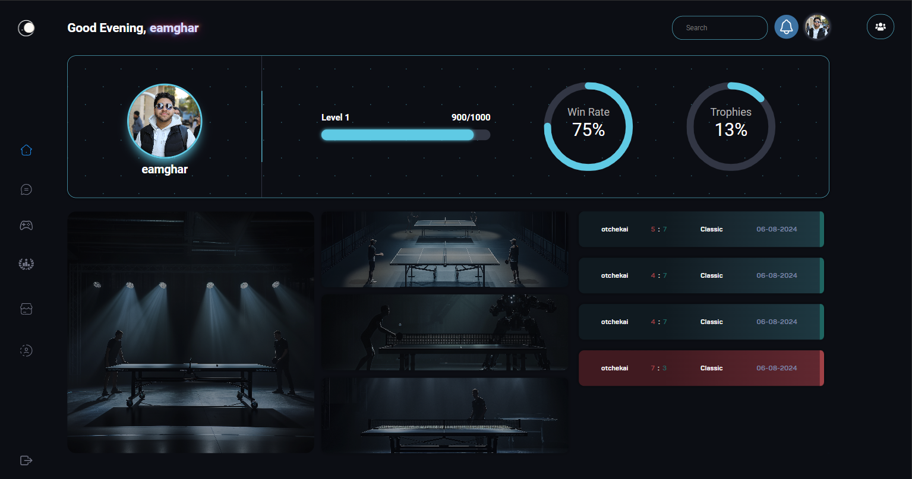
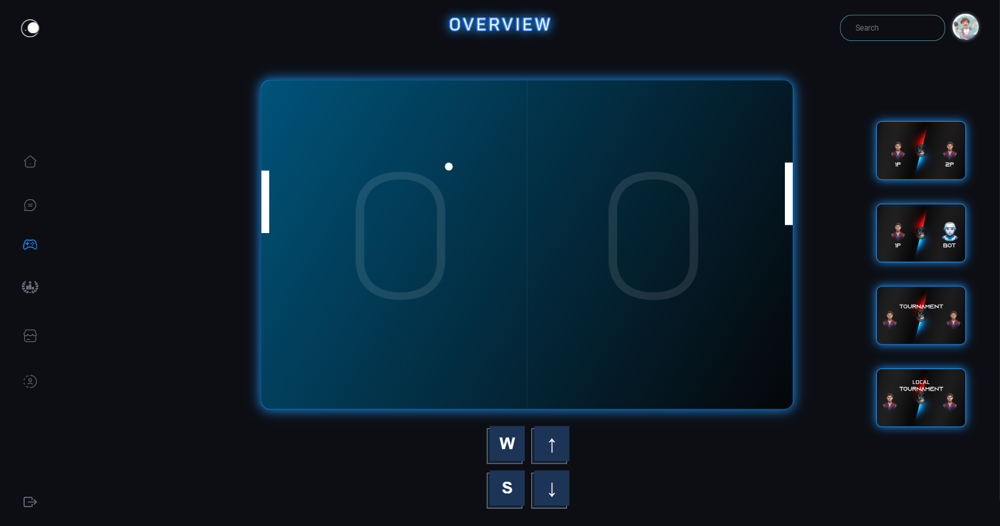
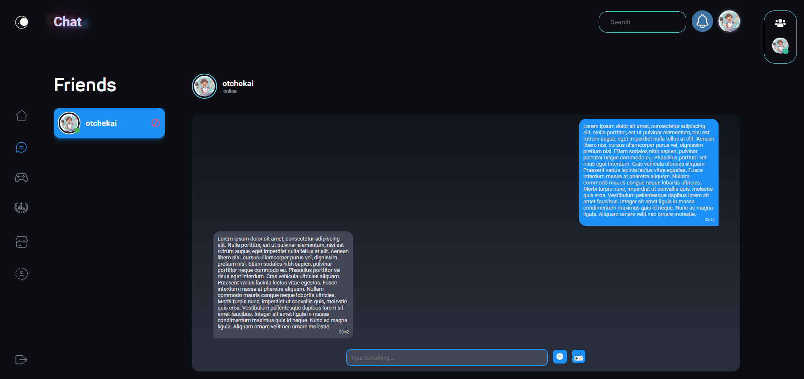
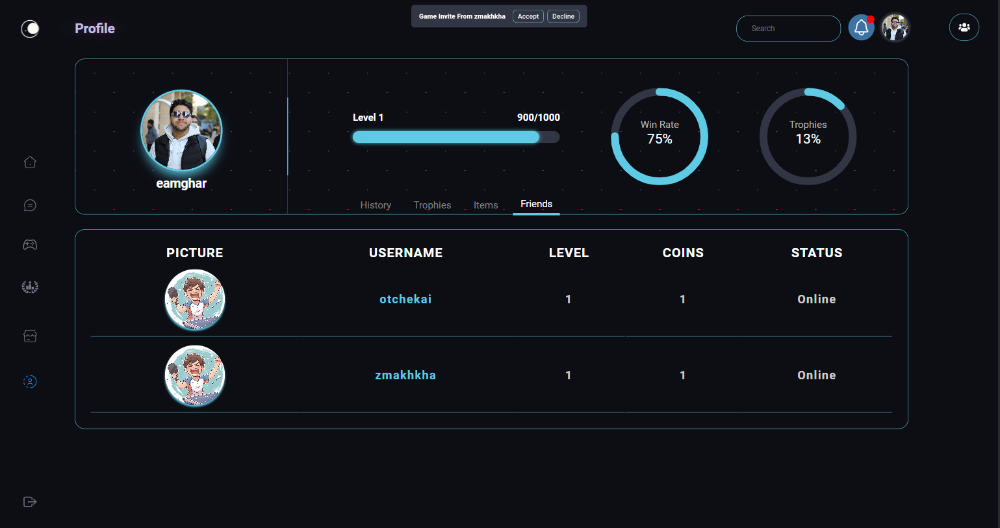
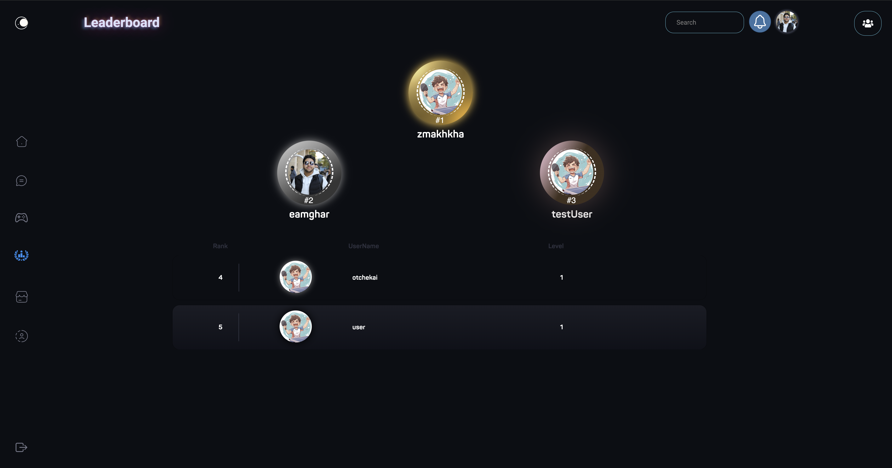
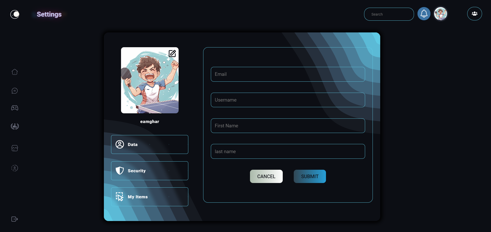

# Ft_Transcendence

## Project Description

**Ft_Transcendence** is a web application built to provide an immersive and customizable gaming experience with a focus on user management, gameplay, and security. The project incorporates features such as user registration, authentication, live chat, and the ability to play Pong games with remote players. The application leverages modern web technologies, including React with TypeScript for the frontend and Django for the backend, ensuring a responsive and scalable architecture.

<div style="display: flex; justify-content: center; flex-wrap: wrap; gap: 5px;">
    
    
    
    
    
    
    
</div>

### Key Features:

- **User Management and Authentication**: Secure user registration, login, and profile management with the ability to track match history and stats.
- **OAuth 2.0 and 2FA**: Remote authentication via OAuth 2.0 with 42 and Discord, combined with Two-Factor Authentication (2FA) for enhanced security.
- **Live Chat and Multiplayer Gameplay**: Real-time chat with direct messaging, game invitations, and the ability to play Pong with remote players.
- **Game Customization**: Options to customize game features such as power-ups, maps, and gameplay settings.
- **Monitoring and Log Management**: Infrastructure setup using the ELK stack for log management and Prometheus with Grafana for monitoring system health and performance.
- **Responsive Design**: Full compatibility with the latest stable version of Google Chrome and responsiveness across all device types.

## Setup Instructions

To set up the project locally, follow these steps:

1. **Clone the Repository**:

   ```bash
   git clone git@github.com:AMGHAR-ELMAHDI/ft_transcendence.git
   ```

2. **Modify Environment Files**:

   - Update the `.env` file in the `./` "aka" `Root` directory with the appropriate settings for the DevOps.
   - Update the `.env` file in the `Django/` directory with the appropriate settings for the backend.
   - Update the `.env` file in the `React/` directory with the appropriate settings for the frontend.

3. **Build and Run the Project**:

   ```bash
   docker-compose up -d
   ```

4. **Access the Application**:
   - The application should now be running in a Docker container. You can access it through your web browser at the specified URL (default: `http://localhost:5173`).

## Technologies Used

- **Frontend**: React + TypeScript
- **Backend**: Django
- **Database**: PostgreSQL
- **Authentication**: OAuth 2.0, JWT, Two-Factor Authentication (2FA)
- **Monitoring**: Prometheus, Grafana
- **Log Management**: Elasticsearch, Logstash, Kibana (ELK Stack)
- **Containerization**: Docker

## Contributors

- **Elmahdi Amghar**: [GitHub Profile](https://github.com/AMGHAR-ELMAHDI)
- **MAKHKHAS Zakaria**: [GitHub Profile](https://github.com/zmakhkha)
- **Mohammed Nassi**: [GitHub Profile](https://github.com/moenassi)
- **Othman Chekairi**: [GitHub Profile](https://github.com/othchek)
